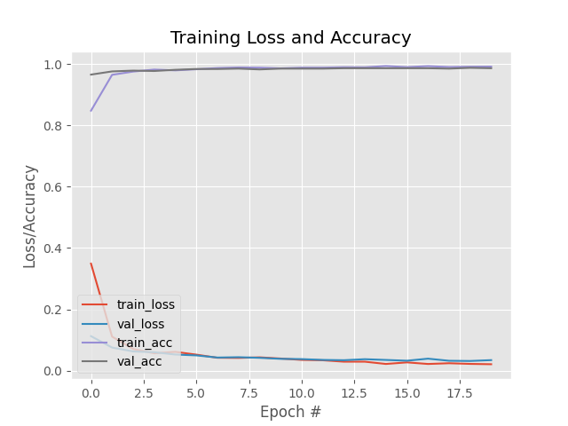

## Contador de pessoas com máscaras

Clique [aqui](https://www.youtube.com/watch?v=v8kghbMAhjs&feature=youtu.be) para visualizar o vídeo do projeto.

## Equipe

| [](https://github.com/BrunoRech) | [](https://github.com/MarioFronza) |
| :-------------------------------------------------------------------------------------------------------------------------: | :-----------------------------------------------------------------------------------------------------------------------: |
|                                     [Bruno Rech](https://github.com/BrunoRech)                                      |                                      [Mário Fronza](https://github.com/MarioFronza)                                       |

## Problema

O problema que a aplicação irá solucionar é o monitoramento manual da quantidade de pessoa s em um determinado estabelecimento, visto que muitos lugares necessitam controlar o número de pessoas em decorrência da pandemia do COVID-19. No cenário ideal, todo usuário deve estar utilizando máscara, sendo muitas vezes um controle manual por parte do estabelecimento.

A ideia seria utilizar um aplicativo na entrada do local. O estabelecimento deve informar ao aplicativo a quantidade máxima de pessoas permitidas. Após isso, o aplicativo detecta a face dos usuários, e verifica se o mesmo está utilizando máscara. Caso esteja, o aplicativo contabiliza o usuário, caso contrário não. Além disso, outro dispositivo deverá estar na saída do estabelecimento, contabilizando os usuários que já saíram.

O projeto futuramente poderia realizar integrações com equipamentos eletrônicos, como portas que só abririam caso o usuário estivesse utilizando máscara.

## Dataset

Será utilizado um dataset público de imagens com faces de pessoas para treinar os algoritmos. O dataset contém 1916 fotos de pessoas com máscaras e 1919 de faces sem máscaras.

[https://drive.google.com/drive/folders/1XDte2DL2Mf_hw4NsmGst7QtYoU7sMBVG](https://drive.google.com/drive/folders/1XDte2DL2Mf_hw4NsmGst7QtYoU7sMBVG)

Este dataset foi construido por [Chandrika Deb](https://chandrikadeb7.github.io/) utilizando o Bing Search API.

O dataset também foi complementado com o disponibilizado na [Kaggle](https://www.kaggle.com/andrewmvd/face-mask-detection?select=images). Foi o dataset mais completo que encontramos em relação a quantidade de faces com máscaras e sem máscaras.

## Técnica

O problema será resolvido utilizando técnicas de redes neurais artificiais para aprender a classificar faces com máscaras. Além disso, o projeto irá utilizar a biblioteca [OpenCV](https://github.com/opencv/opencv) para encontrar faces humanas em imagens, utilizando o algoritmo Viola-Jones e sua técnica de aprendizado de máquina AdaBoost.

#### Arquitetura da rede

A entrada da rede neural será uma imagem convertida em uma matriz de três dimensões. Cada dimensão é uma das camadas de cor (red, green e blue) pelo fato da cor ser um atributo importante na classificação final. Além disso, cada imagem terá uma classe (com máscara e sem máscara), sendo que o resultado que a rede neural irá devolver será a porcentagem da classificação de cada classe.

No processo de detecção facial, as imagens serão convertidas em escala cinza, e processadas pela [OpenCV](https://github.com/opencv/opencv), que irá aplicar os algoritmos e retornar uma lista contendo, em cada posição, outra lista com a posição que a face se encontra na imagem.

#### Validação dos resultados

Para testar a precisão da rede, será selecionado conjuntos de treinamento e testes para serem utilizados na rede neural. Após isso, será aplicado a técnica de validação cruzada do próprio [TensorFlow](https://github.com/tensorflow/tensorflow). Com base nestes resultados o valor da quantidade épocas da rede será ajustada.

#### Detecção de faces

Para realizar a detecção das faces foi utilizado a biblioteca [OpenCV](https://github.com/opencv/opencv) desenvolvida pela Intel. A biblioteca oferece métodos prontos para trabalhar com detecção de faces utilizando as técnicas desenvolvidas por Viola e Jones.

Com base no arquivo cascade (fornecido pela própria [OpenCV](https://github.com/opencv/opencv)), é possível detectar faces frontais humanas, mesmo com a utilização de máscaras. Estes arquivos cascade são construídos utilizando técnicas como Imagem integral e AdaBoost. No momento da leitura da face, a [OpenCV](https://github.com/opencv/opencv) utiliza estes arquivos aplicando seus classificadores em cascata, com o objetivo de encontrar faces em toda a imagem.

O resultado do processo é uma lista contendo a posição de todas as faces encontradas na imagem. Estes dados serão utilizados no modelo gerado pela rede neural, verificando a existência ou não de uma máscara na face.

#### Reconhecimento de máscaras

Para construir a rede neural da maneira simples, fora utilizado a biblioteca [TensorFlow](https://github.com/tensorflow/tensorflow), juntamente com [Keras](https://keras.io/), uma Api
de alto nível para construir e treinar modelos de redes neurais.

Informações da rede neural

- Camada de entrada flatten para vetor de imagens;
- 128 camadas intermediárias dense com a função de ativação rectifier;
- Uma camada de saída binária dense com função de ativação softmax;
- 20% do dataset utilizado para construção do conjunto de testes.


### Resultados obtidos

Abaixo está apresentado os valores obtidos de precisão (accuracy) e loss (erro) que cada rede obteve com diferentes quantidades de épocas.

##### Testes com 10 Épocas

- Accuracy: 0.9862
- Loss: 0.0414

&nbsp;&nbsp;&nbsp;&nbsp;&nbsp;&nbsp;

##### Testes com 20 Épocas

- Accuracy: 0.9914
- Loss: 0.0274

&nbsp;&nbsp;&nbsp;&nbsp;&nbsp;&nbsp;

##### Testes com 30 Épocas

- Accuracy: 0.9963
- Loss: 0.0134

&nbsp;&nbsp;&nbsp;&nbsp;&nbsp;&nbsp;

##### Discussão

Os resultados acabaram ficando muito próximos, porém resolvemos manter o modelo criado com 30 épocas, por possuir o maior valor de precisão e o menor erro registrado.


### Instruções de uso do software

Requisitos:
- [Python](https://www.python.org/)

Clonar projeto executando os seguintes comandos:
- `git clone https://github.com/MarioFronza/trabalho-inc.git`
- `cd trabalho-inc`

Com o projeto clonado, dentro da pasta crie um ambiente virtual executando os seguintes comandos:
- `python3 -m vend venv`
- `source venv/bin/active`
- `pip install -r requirements.txt`

Para realizar o treinamento da rede neural basta executar o seguinte comando:

- `python mask-detector/train_model.py`

*obs: Lembrando que deve existir uma pasta dataset, contendo todas as imagens que serão utilziadas para treinamento de testes da rede.*

Após o treinamento, que pode levar alguns minutos, o aquivo mask_detector.model pode ser testando executando o seguinte script:

- `python mask-detector/detect_camera_mask.py`

Uma camera será aberta utilizando a webcam de seu computador, o script irá tentar encontrar faces para aplicar o modelo criado pela etapa anterior. Um quadrado vermelho deve aparecer para pessoas que não estão utilizando máscaras, e um verde caso a máscara esteja presente.

Para testar o aplicativo, baixe o arquivo app.apk e instale em seu smartphone.

<!--
```shell
tflite_convert --keras_model_file=mask_detector  --output_file=mask_detector.tflite
``` -->
